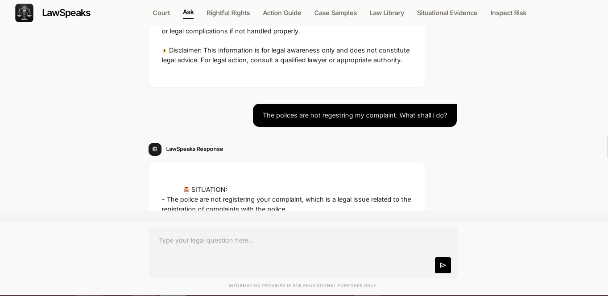
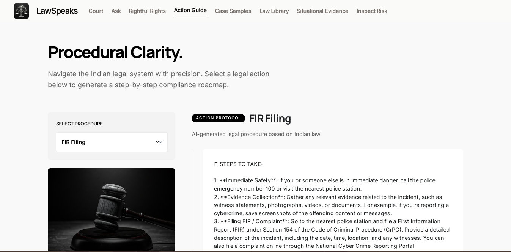
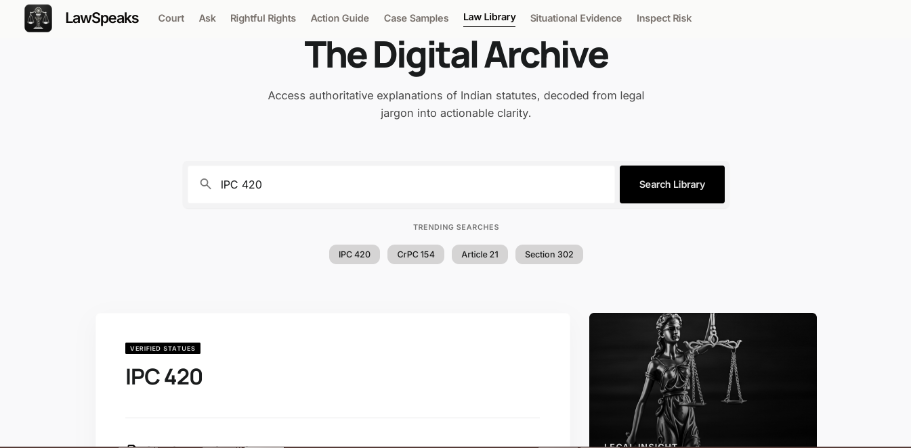
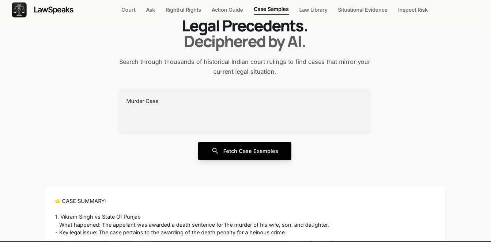
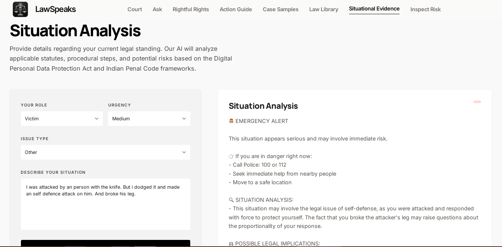

# ⚖️ LawSpeaks – AI-Powered Indian Legal Awareness Assistant

<p align="center">
  
</p>

<p align="center">
<b>Retrieval-Augmented Generation • Indian Legal Awareness • AI Assistant • Grounded Legal Guidance</b>
</p>

# 🎥 Demo Video

<p align="center">
  <video src="ss/final_ls.mp4"
         controls
         width="60%">
  </video>
</p>


# 📸 UI Preview

<table>
  <tr>
    <td align="center">
      <strong>Ask</strong><br>
      
    </td>
    <td align="center">
      <strong>RightFull Rights</strong><br>
      
    </td>
  </tr>

  <tr>
    <td align="center">
      <strong>Legal Action Guide</strong><br>
      
    </td>
    <td align="center">
      <strong>Law Library</strong><br>
      
    </td>
  </tr>

  <tr>
    <td align="center">
      <strong>Case Samples</strong><br>
      
    </td>
    <td align="center">
      <strong>Situational Evidence</strong><br>
      
    </td>
  </tr>

  <tr>
    <td align="center" colspan="2">
      <strong>Inspect Risk</strong><br>
      
    </td>
  </tr>
</table>

---

---


---

# 📖 Overview

LawSpeaks is an AI-powered Indian Legal Awareness Assistant designed to help citizens understand their legal rights, identify applicable laws, and receive structured guidance for common legal situations.

Unlike generic AI chatbots, LawSpeaks uses a Retrieval-Augmented Generation (RAG) pipeline that retrieves relevant legal knowledge before generating responses, significantly reducing hallucinations and improving reliability.

The system is intended for legal awareness and educational purposes and does not replace professional legal advice.

---

# 🎯 Problem Statement

A significant number of citizens struggle to understand:

* Their legal rights
* Applicable laws
* Correct legal procedures
* Government authorities to approach
* Immediate actions during emergencies

Searching online often results in:

* Complex legal language
* Scattered information
* No actionable guidance
* Unreliable AI-generated responses

LawSpeaks addresses these challenges through a retrieval-grounded AI system.

---

# ✨ Key Features

## 🧠 Ask LawSpeaks

Ask legal questions in natural language and receive structured, legally grounded responses.

---

## ⚖️ Know Your Rights

Understand important legal rights in simplified language for everyday situations.

---

## 📋 Legal Action Guide

Step-by-step guidance for procedures such as:

* FIR filing
* Cyber crime complaints
* Consumer complaints
* Legal authorities to approach

---

## 📚 Case Examples

Retrieve and explain similar legal cases to help users better understand practical applications of the law.

---

## 📖 Law Library

Search and understand Indian legal sections in simplified language.

---

## 🧾 My Legal Situation

Describe a real-life situation and receive:

* Legal implications
* Relevant legal concepts
* Practical next steps
* Awareness guidance

---

## 🚨 Risk & Urgency Checker

Analyze situations and identify their urgency level while suggesting immediate lawful actions where appropriate.

---

# 🏗️ System Architecture

```text
User Query
      │
      ▼
Intent Processing
      │
      ▼
Query Embedding
      │
      ▼
FAISS Vector Search
      │
      ▼
CrossEncoder Re-ranking
      │
      ▼
Relevant Legal Context
      │
      ▼
Prompt Engineering
      │
      ▼
LLM (Grounded Generation)
      │
      ▼
Structured Legal Response
```

---

# 🔍 RAG Pipeline

The project follows a Retrieval-Augmented Generation workflow:

1. User submits a legal query.
2. Query is converted into vector embeddings.
3. FAISS retrieves semantically similar legal chunks.
4. CrossEncoder re-ranks retrieved candidates.
5. Relevant legal context is injected into a structured prompt.
6. LLM generates the final grounded response.

This architecture helps minimize hallucinations while improving factual consistency.

---

# 🛠️ Tech Stack

### Backend

* Python
* FastAPI
* Uvicorn

### AI / Machine Learning

* Retrieval-Augmented Generation (RAG)
* Sentence Transformers
* FAISS
* CrossEncoder Re-ranking
* Prompt Engineering

### Frontend

* HTML
* CSS
* JavaScript

### APIs

* Groq LLM API

---

# 📂 Project Structure

```text
LawSpeaks/
│
├── api/
│   ├── app.py
│   ├── generator.py
│   ├── retriever.py
│   ├── config.py
│   └── prompt_templates.py
│
├── rag/
│
├── stich/
│   ├── index.html
│   ├── ask_legal_question/
│   ├── know_your_rights/
│   ├── legal_action_guide/
│   ├── case_examples/
│   ├── law_library/
│   ├── my_legal_situation/
│   └── risk_urgency_checker/
│
├── embeddings/
│
├── requirements.txt
├── README.md
└── render.yaml
```

---

# 🔒 Security Measures

LawSpeaks includes multiple protection layers against misuse:

* Prompt Injection Detection
* Input Sanitization
* Request Validation
* Rate Limiting
* CORS Restrictions
* Error Handling
* Structured Prompt Enforcement
* Retrieval-Grounded Responses

---

# ⚠️ Repository Note

The original legal corpus, FAISS index, and metadata are not included in this repository because of their large size.

The repository focuses on:

* System Architecture
* Backend Implementation
* RAG Pipeline
* Prompt Engineering
* Frontend
* Retrieval Logic

---

# 🚀 Future Improvements

* Domain-specific FAISS indexes
* Multilingual support
* Voice interaction
* OCR for legal documents
* Real-time legal updates
* Government portal integration
* Mobile application

---

# 👨‍💻 Author

Harshal Jadhav

Final Year B.E. Artificial Intelligence & Data Science

Interested in:

* Artificial Intelligence
* Machine Learning
* Backend Engineering
* Retrieval-Augmented Generation
* System Design

---

# 📄 Disclaimer

LawSpeaks is intended solely for legal awareness and educational purposes.

It does not constitute legal advice, nor does it replace consultation with a qualified legal professional.
